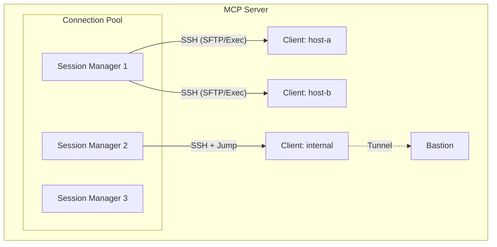

# SSH MCP Server

A high-performance SSH connection management server implementing the [Model Context Protocol (MCP)](https://modelcontextprotocol.io/). Enables AI agents to execute commands, manage files, and perform DevOps operations across remote infrastructure via persistent SSH sessions.

[](https://golang.org)
[](LICENSE)

## Features

- **42 Production-Ready Tools** - Core SSH, file operations, Docker, database, monitoring, and VoIP
- **Persistent Sessions** - SSH connections survive across multiple MCP requests
- **Jump Host Support** - Connect through bastion hosts with the `via` parameter
- **Session Isolation** - Per-client connection pools with automatic cleanup
- **SFTP Native** - Direct file operations without external binaries
- **Auto-Reconnect** - Transparent reconnection on connection loss
- **Zero Dependencies** - Single static binary, no runtime requirements

## Quick Start

### Build from Source

```bash
git clone https://github.com/harsh-2002/SSH-MCP.git
cd SSH-MCP
go build -o ssh-mcp ./cmd/server
```

### Run

```bash
# Run (Defaults to HTTP on port 8000)
./ssh-mcp

# Run on custom port via Env Var
PORT=9090 ./ssh-mcp

# Stdio mode (for local MCP hosts like Claude Desktop)
./ssh-mcp -mode stdio
```

### Docker

```bash
docker build -t ssh-mcp .
docker run -v /path/to/keys:/data ssh-mcp
```

## CLI Flags

| Flag | Default | Description |
|------|---------|-------------|
| Flag | Env Var | Default | Description |
|------|---------|---------|-------------|
| `-mode` | `SSH_MCP_MODE` | `http` | Transport mode: `stdio` or `http` |
| `-port` | `PORT` | `8000` | HTTP server port (http mode only) |
| `-debug` | `SSH_MCP_DEBUG` | `false` | Enable debug logging |
| `-global` | `SSH_MCP_GLOBAL` | `false` | Use single shared SSH manager for all sessions |

## Tools Reference

### Core (5 tools)

| Tool | Description |
|------|-------------|
| `connect` | Establish SSH connection with optional jump host support |
| `disconnect` | Close one or all SSH connections |
| `run` | Execute shell command with configurable timeout |
| `identity` | Get server's public SSH key for authorized_keys |
| `info` | Get remote system information |

### File Operations (5 tools)

| Tool | Description |
|------|-------------|
| `read` | Read remote file contents via SFTP |
| `write` | Write content to remote file |
| `edit` | Find and replace text in file |
| `list_dir` | List directory contents with metadata |
| `sync` | Stream file between two remote nodes |

### Docker (8 tools)

| Tool | Description |
|------|-------------|
| `docker_ps` | List containers |
| `docker_logs` | Get container logs |
| `docker_op` | Start/stop/restart containers |
| `docker_ip` | Get container IP addresses |
| `docker_find_by_ip` | Find container by IP address |
| `docker_networks` | List Docker networks |
| `docker_cp_from` | Copy file from container |
| `docker_cp_to` | Copy file to container |

### Monitoring (7 tools)

| Tool | Description |
|------|-------------|
| `usage` | CPU, memory, disk usage |
| `ps` | Process listing |
| `logs` | Read log files with tail/head |
| `journal_read` | Read systemd journal |
| `dmesg_read` | Read kernel ring buffer |
| `diagnose_system` | Comprehensive system diagnostics |
| `list_services` | List systemd services |

### Database (3 tools)

| Tool | Description |
|------|-------------|
| `db_query` | Execute SQL on PostgreSQL/MySQL in Docker |
| `db_schema` | Get database schema |
| `list_db_containers` | Find database containers |

### Network (4 tools)

| Tool | Description |
|------|-------------|
| `net_stat` | Network statistics (ss/netstat) |
| `search_files` | Find files by name pattern |
| `search_text` | Search file contents (grep) |
| `package_manage` | Install/remove packages |

### VoIP SIP/RTP (10 tools)

| Tool | Description |
|------|-------------|
| `voip_discover_containers` | Find VoIP containers |
| `voip_sip_capture` | Capture SIP packets |
| `voip_call_flow` | Parse SIP call flow from PCAP |
| `voip_registrations` | Extract SIP registrations |
| `voip_call_stats` | Call statistics summary |
| `voip_extract_sdp` | Extract SDP from SIP |
| `voip_packet_check` | Check for RTP/SIP packets |
| `voip_network_capture` | Raw network packet capture |
| `voip_rtp_capture` | Capture RTP streams |
| `voip_network_diagnostics` | Ping, traceroute, port checks |

## Usage Examples

### Basic Connection

```json
// Connect to a server
{"tool": "connect", "arguments": {"host": "10.0.0.1", "username": "admin"}}

// Run a command
{"tool": "run", "arguments": {"command": "hostname"}}

// Read a file
{"tool": "read", "arguments": {"path": "/etc/hostname"}}
```

### Jump Host (Bastion)

```json
// Connect to bastion first
{"tool": "connect", "arguments": {"host": "bastion.example.com", "username": "admin", "alias": "bastion"}}

// Connect to internal server through bastion
{"tool": "connect", "arguments": {"host": "internal-server", "username": "admin", "via": "bastion"}}
```

### File Sync Between Hosts

```json
// Connect to both servers
{"tool": "connect", "arguments": {"host": "server-a", "username": "admin", "alias": "A"}}
{"tool": "connect", "arguments": {"host": "server-b", "username": "admin", "alias": "B"}}

// Copy file from A to B (streams through MCP server)
{"tool": "sync", "arguments": {"source_node": "A", "source_path": "/data/file.txt", "dest_node": "B", "dest_path": "/data/file.txt"}}
```

### Long-Running Commands

```json
// Run with custom timeout (default: 120s)
{"tool": "run", "arguments": {"command": "apt update && apt upgrade -y", "timeout": 600}}
```

## Session Management

### Session Isolation Architecture

Each MCP client gets its own **completely isolated** connection pool with strong security boundaries:

#### Isolation Modes

- **Session-based** (default): Automatic isolation by UUIDv7 session ID
  - Each client connection gets a unique time-ordered session ID
  - Sessions cannot access each other's SSH connections
  - Automatic cleanup after client disconnects

- **Header-based**: Use `X-Session-Key` header for sticky sessions
  - Same key = same connection pool (perfect for load balancers)
  - Different keys = completely isolated pools
  - Each key maintains its own SSH managers and connections
  - **Critical**: Pool isolation is thread-safe and verified with race detector
  
- **Global mode**: Single shared pool with `-global` flag
  - All sessions share one connection manager
  - Suitable for single-user development environments only

#### Security Guarantees

✅ **Virtual Isolation Layer**:
- Each `X-Session-Key` value creates a separate connection pool
- No cross-session access - sessions are siloed at the code level
- Concurrent access is mutex-protected (verified with `-race` detector)
- Memory isolation prevents session data leakage

✅ **Scalability**:
- Handles thousands of concurrent session pools
- Go's efficient memory management (vs Python GIL)
- Lock-free fast paths for high-throughput scenarios
- Adaptive cleanup prevents memory exhaustion

### Session Lifecycle

| Event | Behavior |
|-------|----------|
| Client connects | New session pool created |
| Idle timeout (5 min) | Header-based sessions cleaned up |
| Client disconnects | Session pool destroyed |
| Server shutdown | All connections closed gracefully |

## Architecture



### Component Interaction

```text
┌──────────────────────────────────────────────────────────────────┐
│                           MCP Server                             │
│                                                                  │
│  ┌────────────────────────────────────────────────────────────┐  │
│  │                        Session Pool                        │  │
│  │                                                            │  │
│  │  ┌─────────────┐   ┌─────────────┐   ┌─────────────┐       │  │
│  │  │  Manager A  │   │  Manager B  │   │  Manager C  │       │  │
│  │  │ (Session 1) │   │ (Session 2) │   │ (Header X)  │       │  │
│  │  └──────┬──────┘   └──────┬──────┘   └──────┬──────┘       │  │
│  │         │                 │                 │              │  │
│  └─────────┼─────────────────┼─────────────────┼──────────────┘  │
│            │                 │                 │                 │
│  ┌─────────▼─────────────────▼─────────────────▼──────────────┐  │
│  │                      SSH Connections                       │  │
│  │                                                            │  │
│  │  ┌──────────┐      ┌──────────┐      ┌──────────┐          │  │
│  │  │  User @  │      │  User @  │      │  User @  │          │  │
│  │  │  Host A  │      │  Host B  │      │  JumpBox │          │  │
│  │  └──────────┘      └──────────┘      └────┬─────┘          │  │
│  │                                           │ (Tunnel)       │  │
│  │                                      ┌────▼─────┐          │  │
│  │                                      │  Target  │          │  │
│  │                                      └──────────┘          │  │
│  └────────────────────────────────────────────────────────────┘  │
└──────────────────────────────────────────────────────────────────┘
```

## Performance & Architecture

### Why Go vs Python?

**Memory Management**:
- ✅ No Global Interpreter Lock (GIL) - true parallel execution
- ✅ Efficient goroutines vs heavy OS threads
- ✅ Stack-based allocation reduces GC pressure
- ✅ ~10x lower memory footprint per connection

**Concurrency**:
- ✅ Native lightweight concurrency (goroutines)
- ✅ Lock-free atomic operations for session tracking
- ✅ Fine-grained mutex control (per-alias locking)
- ✅ Verified with race detector under 50+ concurrent goroutines

**Performance**:
- ✅ Single 11MB binary vs Python + dependencies
- ✅ Instant startup (no interpreter initialization)
- ✅ Zero-copy SFTP streaming
- ✅ Native PCAP parsing without CGO overhead

### Safety Guarantees

- **Strict Concurrency**: Validated with race detection checks (`-race`) to ensure thread safety under high load.
- **Security Verified**: Path traversal protections rigorously tested against exploit attempts.
- **Resource Efficient**: Adaptive cleanup reaps idle sessions after 5 minutes to prevent memory leaks.
- **Isolation Tested**: Concurrency tests verify session pools never cross-contaminate.

## Project Structure

```
.
├── cmd/server/           # Application entry point
│   └── main.go
├── internal/
│   ├── ssh/              # Core SSH logic
│   │   ├── manager.go    # Thread-safe connection management
│   │   ├── pool.go       # Session isolation & cleanup
│   │   └── client.go     # SFTP & Exec client
│   ├── sip/              # VoIP packet parsing
│   │   └── parser.go     # PCAP/SIP/RTP analysis
│   └── tools/            # Tool implementations
│       ├── core.go       # Connection tools
│       ├── files.go      # File operations
│       └── voip.go       # VoIP diagnostics
├── Dockerfile            # Distroless production build
├── go.mod                # Go module definition
└── README.md             # Documentation
```

## Development

### Requirements

- Go 1.25+
- libpcap-dev (for VoIP tests)

### Build & Test

```bash
# Build binary
go build -o ssh-mcp ./cmd/server

# Run strict validation tests (Recommended)
go test ./... -v -race
```

### Docker Build

```bash
docker build --build-arg COMMIT_SHA=$(git rev-parse --short HEAD) -t ssh-mcp .
```

## Deployment Guide

### Deployment Models

**Recommended for Production**:
- Behind reverse proxy (nginx/Traefik) with TLS termination
- Private network/VPN only (not exposed to public internet)
- Corporate firewall with restricted access

**Additional Security** (see [SECURITY.md](SECURITY.md)):
- Authentication: API keys, OAuth, or mTLS
- Rate limiting at proxy level
- Audit logging to SIEM

### Protocol Support
- **SSH/SFTP**: Native support for file transfer and command execution.
- **HTTP (MCP)**: Streamable HTTP transport with SSE support.
  - Endpoint: `/mcp` (handles both POST and GET/SSE)
  - Session persistence via `X-Session-Key` header
- **VoIP**: SIP/RTP PCAP analysis capabilities included.

### Load Balancing Strategy

For multi-instance deployments, use **Consistent Hashing** on the `X-Session-Key` header to ensure sticky sessions:

```nginx
upstream mcp_cluster {
    # Hash on X-Session-Key for session affinity
    hash $http_x_session_key consistent;
    server mcp-1:8000;
    server mcp-2:8000;
    server mcp-3:8000;
}

server {
    listen 443 ssl;
    server_name ssh-mcp.internal.example.com;
    
    # TLS configuration
    ssl_certificate /etc/ssl/certs/mcp.crt;
    ssl_certificate_key /etc/ssl/private/mcp.key;
    
    location /mcp {
        proxy_pass http://mcp_cluster;
        proxy_http_version 1.1;
        
        # Preserve X-Session-Key for routing
        proxy_set_header X-Session-Key $http_x_session_key;
        proxy_set_header Upgrade $http_upgrade;
        proxy_set_header Connection "upgrade";
    }
}
```

**Why Sticky Sessions?**
- Each `X-Session-Key` maintains persistent SSH connections on one instance
- Routing the same key to different instances would lose connection state
- Consistent hashing ensures minimal disruption on instance failures

## Contributing

Contributions are welcome! Please ensure all new code includes unit tests and passes the strict validation suite (`go test -race`).

## License

MIT License - see [LICENSE](LICENSE) for details.
